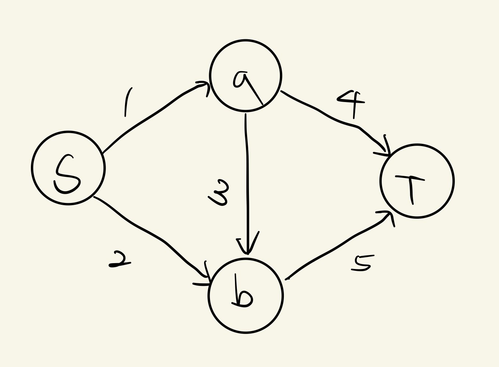
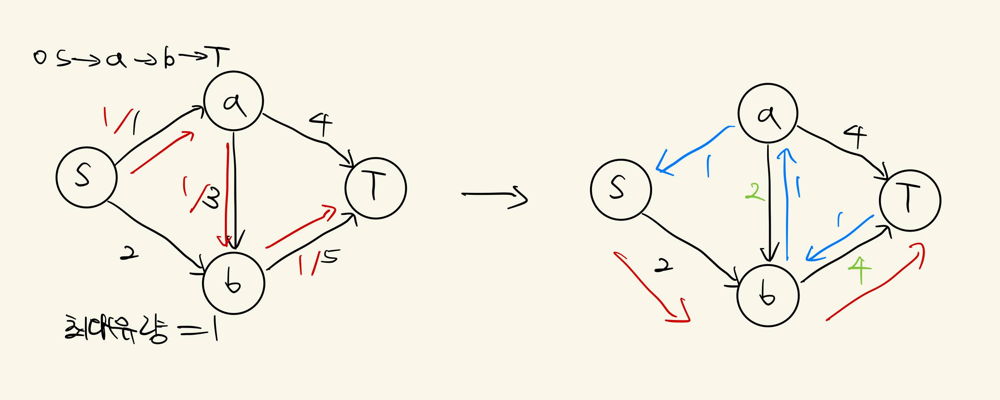
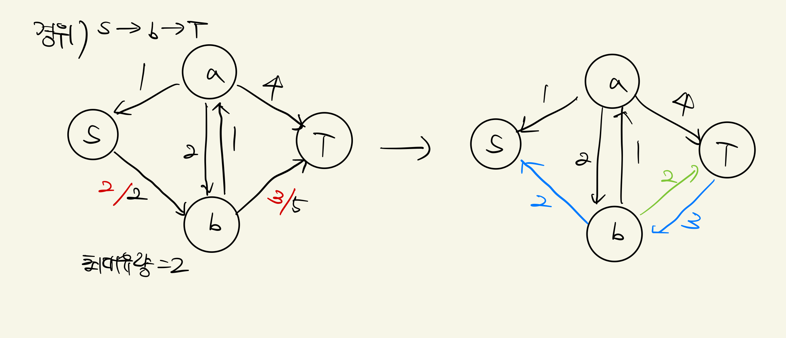
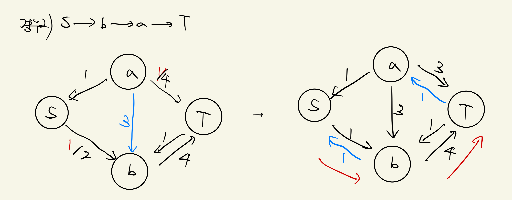
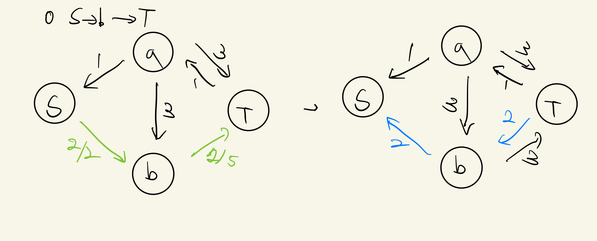
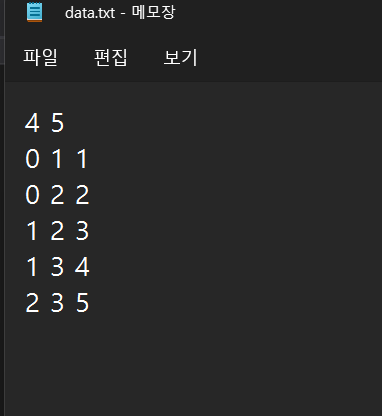
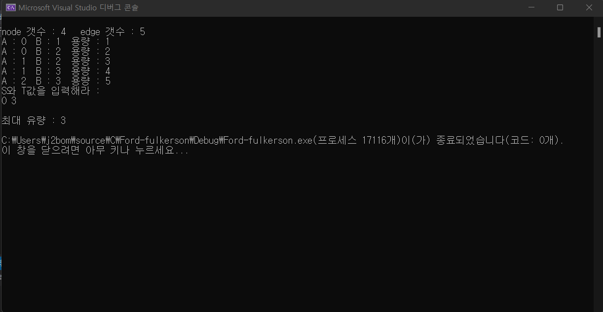

# ford-fulkerson 알고리즘  

## 차례
----------
* ford-fulkerson 알고리즘 내용  
* 동작 방식  
* 코드 실행 결과  
* 성능 분석  

## ford-fulkerson 알고리즘  
----  
* ford-fulkerson 알고리즘을 이해하기 위해 먼저 필요한 개념들을 정리하고 가겠습니다.  
ford-fulkerson 알고리즘은 최대 유랑 알고리즘을 구하는 방식이라 보면 될 것 같습니다. 최대 유랑 알고리즘이란 가중치가 있는 방향그래프 G와 시작노드, 도착노드가 주어졌을때 각 엣지의 용량을 고려하여 시작노드에서 도착노드로 흘려보낼 수 있는 최대 유량을 구하는 알고리즘을 가리킵니다.  
G의 각 엣지 가중치를 용량이라고 하며 (u,v)의 용량을 c(u,v)라고 씁니다. 노드 u, v 사이를 흐르는 유량은 f(u,v)라고 쓰며 유량은 실수치 함수입니다.  
또 여기에 여러 제약조건들이 있다고 합니다.  
```plaintext
1. 용량의 제한 : 유량은 용량을 초과할 수 없습니다.  
2. 유량의 대칭성 : f(u,v) = -f(v,u)입니다.  
3. 유량의 보존 : 각 노드에서 유량은 새로 더해지거나 감소되지 않습니다.
```  
* 그림을 그려서 이해해보도록 노력해보았습니다.  
 일단 ford-fulkerson은 Source에서 부터 Target까지 최대 보낼 수 있는 maximum flow를 찾는것입니다. BFS또는 DFS 탐색을 통해서 source부터 남은 경로의 남은 용량이 0보다 큰 경로들을 바탕으로 Target에 도달하면 되고, 더이상 흐를 수 없을때까지 전송하면 됩니다.  
(아래 그림들은 직접 아이패드로 그린것이고, 구글에서 검색한 것에서 숫자를 바꿔서 해본 것이라 계산실수가 있을 수도 있습니다.)  

<center>
</img>
<center>  

먼저, 모든 유량이 시작되는 정점을 S, 모든 유량이 도착하는 정점을 T라고 놓고 시작해봤습니다. 

<center>
</img>
<center>  

우선 깊이우선탐색(DFS)이나 너비우선탐색(BFS) 방식으로 S에서 T로 가는 경로를 하나 찾습니다. 위 그림에서는 S->a->b->T를 찾았습니다. 이 경로를 통해 흐를 수 있는 최대 유량은 1입니다.  
그런 다음은 유량 상쇄라는 개념을 이해해야되는데, 이 개념이 이 알고리즘을 이해하는데 굉장히 중요한 것 같습니다.  
```
유량상쇄란?
유량 상쇄란, 모든 경로에 기존에 존재하는 간선들과 반대되는 방향의 간선을 추가한 뒤에 각 간선으로 유량을 흘려보냈을 때 반대 방향의 간선으로도 음의 유량을 흘려보냄으로써 유량을 상쇄시키는 것을 의미합니다.
물론, 실제로는 불가능한 얘기이지만 음의 유량을 기록함으로써 잔여 용량을 남겨 추가적인 경로를 탐색할 수 있도록 하기 위한 작업입니다.
```  
정의는 이렇고 실제 제가 이해한 느낌은 위에 제약조건 중 2번 유량의 대칭성을 이용하는 것인데 비유적으로 노드에서 레이저를 쏘면 거울로 반사시켜 팅겨내는 느낌으로 생각하면 쉽게 느껴지는 것 같습니다.  
일단 간선을 흐르는 유량을 빨간색으로 표시, 그런 다음 진행되는 유량상쇄를 파란색, 잔여 용량을 연두색으로 표시해봤습니다.

<center>
</img>
<center>  

일단 첫번째 경우는 위에 상황이 진행되고 S->b->T로 가는 경우입니다.  
S에서 T로 가는 경로가 없을 때까지 반복해줍니다.  
이 경우는 운좋게 빨리 끝난 것 같습니다.

<center>
</img>
<center>  

<center>
</img>
<center>  

두번째 경우는 첫번째 경우와는 다른 S->b->a->T로 진행되는 경우입니다.  
마찬가지로 S에서 T로 가는 경로가 없을때까지 반복해줍니다.  
그냥 호기심에 해봤는데 결과는 같아야 할 것 같았습니다.  
S->b->T로 갈때 좀 어렵게 느껴지는데 유량상쇄를 통해 음의 유량을 받고 그걸 다시 유량흘려보낼때 빼주면 더해지는 것을 알 수 있습니다. 저는 팅겨진걸 받고 더해 다시 팅기는 것처럼 비유적으로 생각해 이해했습니다.
그래서 S->b->a->T에서 최대유량(1), S->b->T에서 최대유량(1)해서 경우1과 같이 최대유량이 2임을 알 수 있습니다.  
처음 S->a->b->T와 합해서 결과를 구할 수 있습니다.

따라서 경우1이든 경우2이든 최대유량은 3임을 알 수 있습니다.

노드6개일때도 생각을 해보았는데 좀 더 복잡하지만 해볼만 했고, 직접해보면 이해에 더 도움이 되는 것 같습니다.  


## 코드 실행 및 결과
---
제가 코딩을 잘 못하는지라 조사를 한 것을 바탕으로 이해하는데 집중하는쪽으로 진행하였습니다.  
일단, 여러가지 함수들 중 ford-fulkerson 알고리즘에 핵심이 되는 함수는 max_flow 함수를 집중적으로 보면 좋을 것 같습니다. 
```C
int max_flow(int source, int sink) {
    int i, j, u;
    // 빈 유량을 초기화합니다.
    int max_flow = 0;
    for (i = 0; i < n; i++) {
        for (j = 0; j < n; j++) {
            flow[i][j] = 0;
        }
    }
    // augmenting path(증가 경로)가 있는 동안, 이 경로를 따라 유량을 증가시킵니다.
    while (bfs(source, sink)) {
        // 유량을 증가시킬 수 있는 양을 결정합니다.
        int increment = oo;
        for (u = n - 1; pred[u] >= 0; u = pred[u]) {
            increment = min(increment, capacity[pred[u]][u] - flow[pred[u]][u]);
        }
        // 이제 유량을 증가시킵니다.
        for (u = n - 1; pred[u] >= 0; u = pred[u]) {
            flow[pred[u]][u] += increment;
            flow[u][pred[u]] -= increment;
        }
        max_flow += increment;
    }
    // 더 이상 경로가 없습니다. 마칩니다.
    return max_flow;
}
```
전체 코드는 ford-fulkerson.c로 올려두었습니다.  
실행 시키기 전 다시 제가 설정했던 상황의 그림을 보겠습니다.  
<center>
</img>
<center>
처음에 이런 상황이었는데요, 이제 실행시키기 위하여 노드 수와 간선(edge) 수를 세보면 4개, 5개가 됩니다. 또한 코드를 실행시키기 위하여 S를 0, a를 1, b를 2, T를 3으로 놓겠습니다.  
그럼 이제 가중치를 고려하면, 노드 0과 1사이에 가중치 1, 0과 2 사이에 2 이런식으로 모든 경우를 data.txt에 기입해줍니다.  
<center>
</img>
<center>
이제 실행시켜 주면 결과가 출력됩니다.  
<center>
</img>
<center>  

## 시간복잡도
---
ford-fulkerson 알고리즘의 시간복잡도는 O(VE^2)입니다. 
간단히 설명 해보자면 최단거리를 고정하면 O(E)개의 증가경로만 찾게 되고, 최단거리는 V이하이므로 VE번 증가 경로를 찾는 것을 알 수 있고, 시간복잡도는 O(VE^2)이 되는 것입니다.  

여담으로, 조사하다가 DFS쓸 때를 ford-fulkerson, BFS쓸 때를 edmons-karp알고리즘이라고 한다는 것을 봤는데 대다수의 블로그나 해외자료에서는 BFS나 DFS 아무거나 사용했고 이 두 알고리즘을 크게 ford-fulkerson방법론이라 불리는 것 같다. 결론은 BFS가 DFS보다 간단해 BFS를 선호하는 경우가 많은 것 같다.
